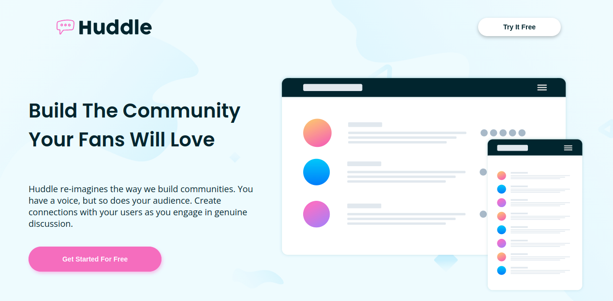

# Frontend Mentor - Huddle landing page with alternating feature blocks solution

This is a solution to the [Huddle landing page with alternating feature blocks challenge on Frontend Mentor](https://www.frontendmentor.io/challenges/huddle-landing-page-with-alternating-feature-blocks-5ca5f5981e82137ec91a5100). Frontend Mentor challenges help you improve your coding skills by building realistic projects.

## Table of contents

- [Overview](#overview)
  - [The challenge](#the-challenge)
  - [Screenshot](#screenshot)
  - [Links](#links)
- [My process](#my-process)
  - [Built with](#built-with)
  - [What I learned](#what-i-learned)
  - [Continued development](#continued-development)
  - [Useful resources](#useful-resources)
- [Author](#author)
- [Acknowledgments](#acknowledgments)

## Overview

### The challenge

Users should be able to:

- View the optimal layout for the site depending on their device's screen size
- See hover states for all interactive elements on the page

### Screenshot

### Links

- Solution URL: [https://github.com/superschooler/huddle-landing-page](https://github.com/superschooler/huddle-landing-page)
- Live Site URL: [https://superschooler.github.io/huddle-landing-page/](https://superschooler.github.io/huddle-landing-page/)

## My process

### Built with

- Semantic HTML5 markup
- CSS custom properties
- Flexbox
- CSS Grid
- Mobile-first workflow
- [Sass](https://sass-lang.com/)

**Note: These are just examples. Delete this note and replace the list above with your own choices**

### What I learned

I pulled the trigger on a Pro subscription to open up more challenges and give me access to the Figma files. It makes a **world of difference** having access to the Figma files to see the font sizes for mobile and desktop, be able to work out the exact padding and margins, and see how exactly drop shadows are made. The only downside is that it took me _a lot longer_ to do this project because I wanted everything to be perfect.

I used an abundance of clamps in my CSS to keep the media queries a bit simpler and allow the text and padding to grow with the page so it would look great on mobile, tablet, and desktop. It took a bit of math to figure out the ideal clamp sizes, but I'm happy with how it turned out.

Additionally, this was my first time using Sass and I enjoyed it a lot! I didn't use a lot of Sass-specific features, but liked being able to nest CSS styles and have my stylesheet be a lot more specific. I'm sure this would be a tremendous help on a larger website to avoid CSS conflicts.

I also used CSS grid for the first time in the footer since I couldn't get everything to line up right with Flexbox. It was challenging getting it to work how I wanted, but isn't so bad now that I've used it and understand how the layout works. I'm sure I'll use it again in future projects where Flexbox isn't the best solution for the layout I'm looking for.

### Continued development

I plan to do a few more small HTML & CSS projects over the next couple of weeks, but have my wedding coming up and don't want to dive too deep in JavaScript only to be out of it for a couple of weeks. In the meantime, I'll keep refining my skills with HTML, CSS, Bootstrap, Sass, and plan to give Tailwind CSS a shot since I've had a couple of people recommend it over Bootstrap. After the wedding it's game on to learn as much as possible and get job ready.

### Useful resources

- [MDN Docs - Clamp](https://developer.mozilla.org/en-US/docs/Web/CSS/clamp) - This resource helped me set up clamps well on font sizes and padding to make for a perfectly responsive site.
- [Sass Cheatsheet](https://devhints.io/sass) - This was my first time using Sass and I relied on this cheatsheet a bit to help me remember how to use variables, mainly. I'm sure I'll be relying on this more as I need to get into loops and more complex Sass.

## Author

- Website - [Add your name here](https://www.your-site.com)
- Frontend Mentor - [@yourusername](https://www.frontendmentor.io/profile/yourusername)
- Twitter - [@yourusername](https://www.twitter.com/yourusername)- Website - [Brian Schooler](https://www.brianschooler.com)
- Frontend Mentor - [@superschooler](https://www.frontendmentor.io/profile/superschooler)
- Twitter - [@superschooler](https://twitter.com/SuperSchooler)
- GitHub - [@superschooler](https://github.com/superschooler)

## Acknowledgments

[CodeSTACKr's](https://www.youtube.com/codeSTACKr) YouTube video _[Sass Tutorial for Beginners - CSS With Superpowers](https://www.youtube.com/watch?v=_a5j7KoflTs&t=463s)_ was very helpful in getting me up and running with Sass quickly and without having to install anything on my computer.
